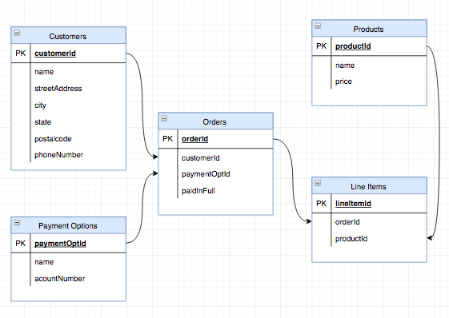

# bangazon-db

ERD

Use SQLite and the sqlite3 module to create your tables. These tables are required:

customers
This table will store the following information

A unique customer id (integer).
All information collected about the user. In the group project you will prompt the user for the folowing info:
customer name
street address
city
state
postal code
phone number
payment_options
This table will contain the following information

A unique payment option id (integer)
Payment option name
Payment option account number
products
This table will store the following information

A unique product id (integer)
Product name
Product price
orders
This table will store the following information

A unique order id (integer)
The order's customer id
The order's payment option id
Whether the order has been paid in full
order_line_items This table will store the following information

A unique line item id (integer)
The order id
The product id
Plan to leave enough time to test drive your db with as many queries as you can. Soon we will dive into writing tests that confirm that we can read and write to our databases properly. For now, just write out a series of queries like the ones you worked through in the previous exercises and use the DB Browser app to put your tables through their paces.
